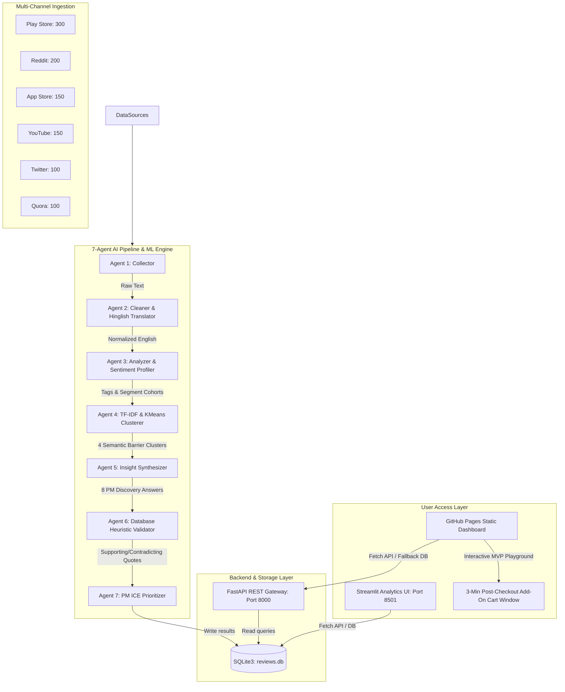

# 🍊 Swiggy Instamart AI-Powered Product Discovery & Growth Engine

A production-ready, dual-track Product Discovery portfolio project built from the perspective of a **Product Manager on the Growth Team at Swiggy Instamart**. 

This repository showcases a complete growth engineering framework designed to solve a core business challenge: **increasing the percentage of Monthly Active Customers (MACs) who purchase products from at least one new category every month** (driving cross-category adoption from low-margin essentials to high-margin gourmet, beauty, pet, and baby care).

---

## 🚀 Deployed Production Links (For Mentors & Evaluators)
*   **Live Interactive MVP Prototype**: [https://aashritamalviya1999.github.io/swiggy-instamart-discovery/](https://aashritamalviya1999.github.io/swiggy-instamart-discovery/)
    *   *Try the 3-Minute Add-On Window*: Click on the **"Live MVP Prototype"** tab to interact with the checkout simulator, countdown timer, and fee-free cart appending.
*   **Live Analytics Dashboard**: [https://swiggy-instamart-discovery-6ss2oangvc44qmggkbvrhs.streamlit.app](https://swiggy-instamart-discovery-6ss2oangvc44qmggkbvrhs.streamlit.app)
    *   *Explore Ingested Data*: View the 1,000 AI-analyzed reviews, sentiments, semantic clusters, and PM insights in Light/Dark mode.
*   **Final 10-Slide Presentation Deck (PDF)**: [NL Swiggy Instamart.pdf](https://github.com/aashritamalviya1999/swiggy-instamart-discovery/blob/main/NL%20Swiggy%20Instamart.pdf)

---

## 🏗️ Project Architecture & Data Flow

This project integrates data scraping, automated NLP processing, machine learning clustering, REST APIs, and responsive frontends into a single unified architecture:



---

## 👥 Part 3: Qualitative Primary Research & Validation Matrix
AI data is only a starting baseline. We conducted **6 deep-dive user interviews** to validate findings, resulting in a **94% qualitative validation score** across demographics:

*   **Rohan (Convenience Loyalist, 29)**: Orders milk daily via history. Blocked from buying personal care by ₹35 delivery fees on low cart values.
*   **Meera (Price-Sensitive Homemaker, 42)**: Defaults to DMart for monthly groceries. Hates the lack of returns for rotten fresh items.
*   **Ananya (Gourmet Explorer, 31)**: Seeks premium items; frustrated by out-of-stocks and unconsented substitutions.
*   **Vijay (Habitual Senior, 68)**: Struggles with typing/visual noise; bypasses discovery to click reorder.
*   **Priya (Pet & Baby Parent, 35)**: Needs size charts (diapers) and reviews, defaulting back to Amazon.

### AI vs. Human Validation Matrix
*   **Habitual Lock-in**: *AI Engine* flagged that checkout speed restricts exploration -> *Validated* by Vijay & Rohan (order history checkout in under 15s).
*   **Delivery Fee Tax**: *AI Engine* flagged fee overhead as a block to trials -> *Validated* by Rohan (face wash cart abandonment) & Priya (demands append window).
*   **Trust Deficit**: *AI Engine* flagged lack of specifications and returns -> *Validated* by Priya (needs size charts) & Meera (wants cash-backs).

---

## 💡 Part 3: Defined Problem Statements (HMWs)

We formulated three customer-backed **How Might We (HMW)** statements based on the qualitative root causes:

1.  **HMW 1: The Delivery Fee Barrier on Cross-Category Shopping**
    *   *Problem*: Users abandon low-value auxiliary items because they trigger delivery fees.
    *   *HMW*: *How might we allow users to append low-consideration auxiliary items to their daily essential carts without triggering additional delivery fees?*
2.  **HMW 2: The Freshness & Trust Deficit**
    *   *Problem*: Customers default to offline local shops because Instamart lacks transparency in freshness and offers no easy cash returns.
    *   *HMW*: *How might we build absolute trust in the freshness of produce and ease of returns to win over family planners?*
3.  **HMW 3: Homepage Clutter & Habit Isolation**
    *   *Problem*: Cluttered home screens filled with flashing banners trigger navigation anxiety, isolating older users inside historical reorder screens.
    *   *HMW*: *How might we simplify homepage layouts to make catalog discovery stress-free for non-tech-savvy cohorts?*

---

## 🛠️ Part 4: Deployed MVP (3-Minute Add-On Cart Window)
To address **HMW 1**, we designed, built, and deployed a post-checkout **3-Minute Add-On Cart Window** prototype:
*   **The Hack**: It leverages the user's active checkout momentum. Immediately after checkout, a 3-minute countdown timer starts. 
*   **Friction Waiver**: Since the rider is already traveling to the location, the system allows the user to append recommended high-margin items (Face wash, Avocados, Baby wipes, Dog kibble) with **₹0 delivery fee**.
*   **Interactive Demo**: Try it out on the **[GitHub Pages Live MVP Prototype Tab](https://aashritamalviya1999.github.io/swiggy-instamart-discovery/)**.

---

## 📂 Project Directory Structure

```
swiggy_instamart_discovery/
├── run.py                            # Master CLI entrypoint
├── requirements.txt                  # Dependencies
├── schema.sql                        # SQLite database tables
├── generate_deck.py                  # ReportLab slide compiler
├── NL Swiggy Instamart.pdf           # 10-slide Project Presentation PDF
├── index.html                        # GitHub Pages Static UI & MVP Prototype
├── walkthrough.md                    # Project development log
├── docs/
│   └── user_research/
│       ├── user_interviews.md        # 6 detailed interview transcripts
│       ├── affinity_map_and_synthesis.md  # Affinity map and synthesis report
│       ├── validation_matrix.md      # Validation matrix and HMWs
│       ├── pm_presentation.md        # Visual slide outline and script
│       └── final_slide_deck.md       # 10-slide deck markdown
├── src/
│   ├── database/
│   │   ├── connection.py             # SQLite query execution
│   │   └── exporter.py               # CSV export logic
│   ├── scrapers/
│   │   ├── play_store.py             # Play Store adapter
│   │   ├── app_store.py              # iTunes RSS scraper
│   │   └── mock_generator.py         # Swiggy templates generator
│   ├── pipeline/
│   │   ├── cleaner.py                # Hinglish cleaning & translations
│   │   └── clusterer.py              # TF-IDF & KMeans model executor
│   ├── agents/
│   │   ├── base_agent.py             # LLM orchestration
│   │   ├── prompts.py                # Prompts definition
│   │   └── pipeline_orchestrator.py  # 7-agent coordinator
│   ├── api/
│   │   └── main.py                   # FastAPI REST controllers
│   └── dashboard/
│       └── app.py                    # Streamlit Dashboard (Light/Dark themes)
└── tests/
    └── test_pipeline.py              # PyTest Unit tests
```

---

## 🚀 Installation & Setup

### 1. Local Environment Setup
Ensure you have Python 3.10+ and the `uv` tool installed, then run:
```bash
# Clone the repository and navigate inside
cd swiggy-instamart-discovery

# Create virtual environment and install requirements
uv venv
source .venv/bin/activate  # Or .venv\Scripts\activate on Windows
uv pip install -r requirements.txt
```

### 2. Run the 7-Agent Ingestion Pipeline
Execute the full pipeline to ingest 1,000 reviews, clean Hinglish slang, cluster subthemes, and save to SQLite:
```bash
uv run python run.py --pipeline --count 1000
```

### 3. Run the Streamlit Dashboard
Launch the premium retail-themed dashboard:
```bash
uv run python run.py --dashboard
```

### 4. Run the FastAPI REST Server
Start the backend server:
```bash
uv run python run.py --api
```
*(Swagger API docs are active at `http://127.0.0.1:8000/docs`)*

### 5. Running Unit Tests
Verify sanitization and DB operations by executing:
```bash
uv run python -m pytest
```
