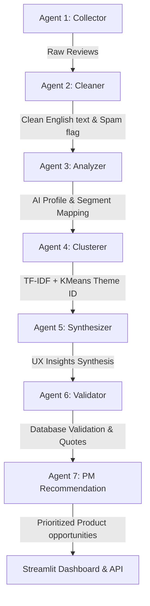

# 🍊 Swiggy Instamart AI-Powered Product Discovery Engine

A production-quality AI-Powered UX research and Product Discovery Engine built for Product Managers at **Swiggy Instamart** to analyze customer feedback at scale and identify opportunities for increasing cross-category monthly active purchases.

The system automates the collection of customer reviews across 10 platforms, cleans Hinglish and spam content, runs a sequence of **7 Specialized AI Agents** to extract intent/barriers/segments, clusters feedback into subthemes using **TF-IDF & KMeans vector embeddings**, and ranks product recommendations using an **ICE Scoreboard**.

---

## 👥 Product Management Objectives
*   **Business Goal**: Increase the percentage of Monthly Active Customers purchasing from at least one new category every month (e.g. converting routine grocery shoppers to buy personal care, baby care, pet care, cleaning essentials, etc.).
*   **Goal Mapping**: Identify exact friction barriers preventing category exploration and model segment-specific features to solve them.

---

## 🤖 7-Agent AI Workflow Sequence



1.  **Agent 1 (Collector)**: Live scrapes Play Store & iTunes RSS feeds, with template fallback, compiling a dataset of 1,000 feedback records.
2.  **Agent 2 (Cleaner)**: Sanitizes raw text, removes URLs/emojis, normalizes spelling, flags duplicates, and translates Hinglish/slang words to English.
3.  **Agent 3 (Analyzer)**: Extracts sentiment, intent, barriers, motivations, pain points, and maps customers to predefined user segments.
4.  **Agent 4 (Clusterer)**: Clusters feedback into 4 semantic themes using TF-IDF vectorization and KMeans, auto-labeling themes using LLM.
5.  **Agent 5 (Synthesizer)**: Formulates synthesized answers to the 9 core PM discovery questions.
6.  **Agent 6 (Validator)**: Computes validation metrics against SQLite database records, selecting representative user quotes.
7.  **Agent 7 (PM Recommendation)**: Compiles ICE-scored Product Opportunities based on evidence and business value metrics.

---

## 📂 Project Directory Structure

```
swiggy_instamart_discovery/
├── run.py                            # Master CLI entrypoint
├── requirements.txt                  # Dependencies
├── schema.sql                        # SQLite database tables
├── data/
│   ├── database.db                   # SQLite DB
│   └── instamart_feedback_1000.csv    # Consolidated CSV Export
├── docs/
│   ├── architecture.md               # Architecture detail & flow diagrams
│   ├── setup_deployment.md           # Local setup and cloud deployment guide
│   └── api_docs.md                   # REST API routes specifications
├── src/
│   ├── config.py                     # Configuration settings
│   ├── database/
│   │   ├── connection.py             # SQLite query execution
│   │   └── exporter.py               # CSV export logic
│   ├── scrapers/
│   │   ├── play_store.py             # Play Store adapter
│   │   ├── app_store.py              # Custom iTunes RSS scraper
│   │   └── mock_generator.py         # Swiggy templates generator
│   ├── pipeline/
│   │   ├── cleaner.py                # Data normalizer & Hinglish translation
│   │   └── clusterer.py              # TF-IDF & KMeans model executor
│   ├── agents/
│   │   ├── base_agent.py             # LLM & Heuristics engine
│   │   ├── prompts.py                # Prompts definition
│   │   └── pipeline_orchestrator.py  # 7-agent coordinator
│   ├── api/
│   │   └── main.py                   # FastAPI REST controllers
│   └── dashboard/
│       └── app.py                    # Streamlit Dashboard (Blue/Orange/White)
└── tests/
    └── test_pipeline.py              # Unit tests
```

---

## 🚀 Quick Start Guide

### 1. Installation
Ensure you have Python 3.10+ and the `uv` tool installed, then run:
```bash
# Clone the repository and navigate inside
cd swiggy_instamart_discovery

# Create virtual environment and install requirements
uv venv
source .venv/bin/activate  # Or .venv\Scripts\activate on Windows
uv pip install -r requirements.txt
```

### 2. Run the Ingestion & Analysis Pipeline
Execute the full 7-agent pipeline to process 1,000 reviews, save to SQLite, and export the consolidated CSV:
```bash
# Executing pipeline CLI
uv run python run.py --pipeline --count 1000
```

### 3. Run the Streamlit PM Dashboard
Launch the premium retail-themed dashboard (Blue, Swiggy Orange, and White):
```bash
# Launching dashboard
uv run python run.py --dashboard
```

### 4. Run the FastAPI REST Server
Start the backend server:
```bash
# Launching FastAPI
uv run python run.py --api
```
*(Swagger UI is available at `http://127.0.0.1:8000/docs`)*

---

## 🧪 Running Unit Tests
Verify code modules, cleaner sanitization, and DB operations by executing:
```bash
uv run python -m pytest
```
All unit tests should complete successfully.
