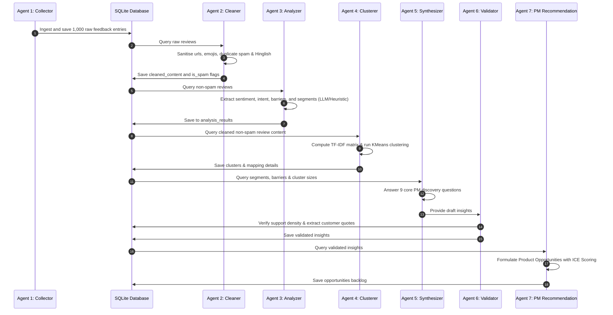

# System Architecture & Data Flow

This document details the system design, SQLite database schema, and sequential data pipeline flows for the Swiggy Instamart AI-Powered Product Discovery Engine.

---

## 🏗️ High-Level System Architecture

The engine is built using a clean, layered architecture separating raw ingestion, text normalization, vector space analysis, agentic synthesis, and visualization.

```
┌────────────────────────────────────────────────────────┐
│                   Streamlit PM Dashboard               │
│                (Blue / Orange / White Theme)           │
└───────────────────────────┬────────────────────────────┘
                            │ Queries Data
┌───────────────────────────▼────────────────────────────┐
│                        FastAPI REST API                │
└───────────────────────────┬────────────────────────────┘
                            │ SQL Queries
┌───────────────────────────▼────────────────────────────┐
│                 SQLite Relational Database             │
│                        (database.db)                   │
└───────────────────────────▲────────────────────────────┘
                            │ Writes Cleaned & Analyzed Data
┌───────────────────────────┴────────────────────────────┐
│                  7-Agent Pipeline Orchestrator          │
└───────────────────────────▲────────────────────────────┘
                            │ Ingests & Normalizes
┌───────────────────────────┴────────────────────────────┐
│         App/Play Store & Mock Ingestion Module         │
└────────────────────────────────────────────────────────┘
```

---

## 🔁 Complete Data Pipeline Flow



---

## 🗄️ Database Schema Details

The database is powered by SQLite (`data/database.db`) and conforms to the following schema structure:

### 1. `reviews`
Stores the ingested customer feedback metadata, platform tags, and baseline values.
*   `id` (TEXT, PRIMARY KEY): Unique review identifier.
*   `platform` (TEXT): Platform source (e.g. `play_store`, `app_store`, `reddit`, etc.).
*   `author` (TEXT): Feedback author name.
*   `raw_content` (TEXT): Original raw text feedback.
*   `cleaned_content` (TEXT): Cleaned, url/emoji-stripped and Hinglish-normalized English translation.
*   `rating` (INTEGER): Rating out of 5 (for reviews) or NULL.
*   `created_at` (TIMESTAMP): Time of posting.
*   `url` (TEXT): Original thread or posting URL.
*   `language` (TEXT): Detected language.
*   `primary_purchased_category` (TEXT): Heuristic primary category bought.
*   `willing_to_try_new` (TEXT): Customer's category exploration willingness ("Yes", "No", "Undecided").
*   `new_categories_of_interest` (TEXT): JSON array of categories they'd explore.
*   `barrier_reason` (TEXT): Baseline classification barrier.
*   `is_spam` (INTEGER): Flagged as spam/referral/duplicate (1) or valid (0).

### 2. `analysis_results`
Stores AI-processed behavioral profiles.
*   `review_id` (TEXT, PRIMARY KEY): References `reviews(id)`.
*   `sentiment` (TEXT): AI classified sentiment (`positive`, `neutral`, `negative`).
*   `summary` (TEXT): One-sentence review summary.
*   `intent` (TEXT): Primary transaction intent.
*   `barriers` (TEXT): JSON list of detected barriers.
*   `motivations` (TEXT): JSON list of triggers.
*   `pain_points` (TEXT): JSON list of specific complaints.
*   `feature_requests` (TEXT): JSON list of recommendations.
*   `shopping_behavior` (TEXT): Habit classification (e.g. Routine Buyer, Experiment Seeker).
*   `user_segment` (TEXT): Predefined segment type (e.g. Pet Owner, Baby Product Buyer).
*   `detected_categories` (TEXT): JSON list of Instamart categories mentioned.

### 3. `clusters`
Stores KMeans thematic cluster definitions.
*   `id` (INTEGER, PRIMARY KEY AUTOINCREMENT): Cluster ID.
*   `name` (TEXT): Cluster title summary.
*   `subtheme` (TEXT): Core subtheme tags.
*   `description` (TEXT): Summary description of cluster complaints.
*   `size` (INTEGER): Count of reviews mapped.

### 4. `review_clusters`
Map reviews to clusters with coordinate distance metric.
*   `review_id` (TEXT): References `reviews(id)`.
*   `cluster_id` (INTEGER): References `clusters(id)`.
*   `distance` (REAL): Vector distance to cluster centroid.

### 5. `insights`
Stores synthesized UX discovery reports.
*   `id` (INTEGER, PRIMARY KEY AUTOINCREMENT): Insight ID.
*   `question` (TEXT): Core PM question answered.
*   `answer` (TEXT): Synthesized report answer.
*   `confidence_score` (REAL): Confidence level based on quote density.
*   `supporting_reviews_count` (INTEGER): Number of database records supporting the insight.
*   `supporting_quotes` (TEXT): JSON list of actual user review quotes.
*   `platforms` (TEXT): JSON list of sources where seen.
*   `contradicting_opinions` (TEXT): JSON list of contradicting user feedback.
*   `confidence_explanation` (TEXT): Reasoning justification.

### 6. `opportunities`
Prioritized PM opportunity roadmap.
*   `id` (INTEGER, PRIMARY KEY): Opportunity ID.
*   `title` (TEXT): Proposed feature title.
*   `problem` (TEXT): Customer problem solved.
*   `evidence` (TEXT): Quantitative data backing.
*   `representative_quotes` (TEXT): JSON list of customer quote attachments.
*   `frequency` (TEXT): Barrier occurrence frequency (High/Medium/Low).
*   `impact` (REAL): Expected business GMV impact (1-10).
*   `confidence` (REAL): Technical confidence (1-10).
*   `opportunity_score` (REAL): Prioritized ICE score (`Impact * Confidence`).
*   `business_value` (TEXT): Detailed description of business growth value.
