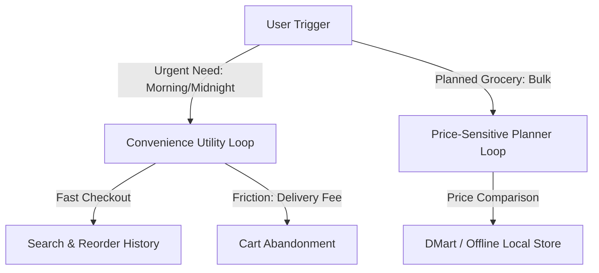

# Affinity Map & Interview Synthesis Report

This document groups the observations from our six qualitative user interviews into a thematic Affinity Map and provides an executive synthesis report detailing key customer patterns and behaviors.

---

# Part 1: Affinity Map

We have grouped raw customer quotes and behaviors from the interviews into five major thematic pillars:

| Theme | Observations & Customer Quotes | Involved Personas | Product Implication |
| :--- | :--- | :--- | :--- |
| **1. Delivery Fee & Pricing Friction** | - "Paying 30 rupees in fees for a 75 rupee grocery order feels like a rip-off." - "Prices on the app are higher than local shops... DMart is 10-15% cheaper." - "If Zepto offers a free delivery coupon, we immediately switch." | - Rohan (Loyalist) - Meera (Homemaker) - Kabir (Gen-Z) | High checkout fee overhead acts as a massive block for adding small single items from auxiliary categories. |
| **2. Freshness, Quality & Return Trust** | - "Two of the tomatoes were completely squished and moldy... I don't trust them with fresh items." - "My local vendor replaces bad items without question; the app refund goes to wallet." - "I hesitate to buy grapes for my child because there's no freshness guarantee." | - Rohan (Loyalist) - Meera (Homemaker) - Priya (Parent) | Quality issues in fresh vegetables destroy category trust; lack of instant cash refunds to original accounts increases adoption friction. |
| **3. Habit Loops & UI Overwhelm** | - "I open the app, click Reorder, and check out in 10 seconds. I don't see other tabs." - "The homepage is very confusing with moving banners... it feels like a busy railway station." - "I strictly go to History and click Reorder. I don't like typing." | - Rohan (Loyalist) - Vijay (Senior) - Kabir (Gen-Z) | Ultra-fast habit-based checkout flows actively prevent users from browsing new categories; cluttered homepage layouts trigger navigation anxiety. |
| **4. Catalog Information Gaps** | - "If I need a face wash, I buy on Nykaa/Amazon where I get detailed reviews and ingredient lists." - "On Instamart, there is no brand warranty card, no specifications, no way to know if kitchen knives are good." - "diapers are cheaper on Amazon, and on Instamart they don't even show the size chart." | - Ananya (Gourmet) - Priya (Parent) | Users refuse to purchase high-consideration items (beauty, baby, home appliances) due to lack of reviews, specifications, sizing, and warranty details. |
| **5. Inventory & Substitution Friction** | - "I will plan a recipe, buy organic spinach... but they substitute standard spinach because it went out of stock." - "Standard dog food bags (10-15kg) are always out of stock or too heavy for delivery." - "Brand loyalty is zero; I switch to Blinkit if my Greek yogurt brand is out of stock." | - Ananya (Gourmet) - Priya (Parent) - Kabir (Gen-Z) | Unstable stock levels and unconsented substitutions break user cooking plans and drive them straight to competitor apps. |

---

# Part 2: Interview Synthesis Report

## 1. Core Behavioral Patterns
Our research shows that Swiggy Instamart usage is heavily split into two distinct behavioral archetypes:
* **The Convenience Utility**: Users (like Rohan and Kabir) open the app with high intent to solve an immediate, urgent need (e.g., morning coffee supplies, midnight cravings). They spend very little time in the app (often checking out in under 30 seconds) and navigate directly via their **Search** or **Order History** bars.
* **The Bulk Planner**: Users (like Meera and Priya) rely on offline wholesale retailers (DMart) or Amazon for planned monthly shopping. They view quick-commerce as a high-priced luxury, reserving it strictly for emergencies.

## 2. Key Motivations & Triggers
* **Instant Gratification**: The primary trigger is time-sensitivity. Users are willing to pay a premium when they need an item in under 15 minutes (e.g., sudden guests, cooking midway, dog food running out).
* **Cognitive Ease**: The "Buy it Again" tab and historical reorder loops minimize decision fatigue, especially for repetitive items like milk, bread, and eggs.

## 3. Critical Friction Barriers to Category Exploration
* **High Cart Thresholds**: Quick-commerce apps impose handling fees and delivery fees on small orders. Users who primarily order milk (low cart value) are unwilling to "experiment" by adding a personal care item because it triggers additional delivery costs.
* **The "Black Box" Quality Trust**: For high-trust categories like fresh meat, vegetables, and baby products, the lack of transparency (no packaging date, no origin details, no quality certification) acts as a hard block.
* **Cluttered App Real Estate**: The density of promotional banners, surge alerts, and animated carousels makes browsing feel overwhelming for older users, causing them to retreat into safe, familiar habit loops (reorder histories).
