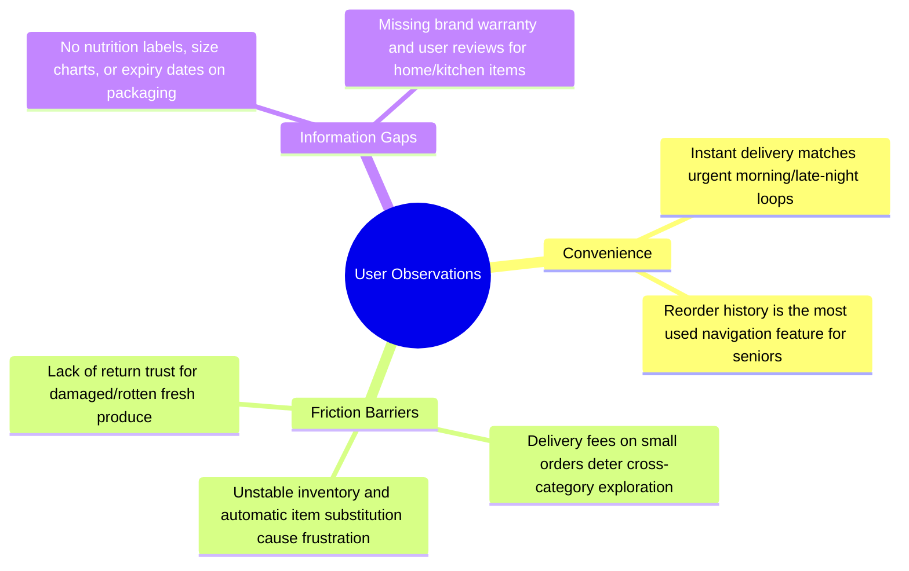

# Swiggy Instamart Qualitative User Research: 6 Detailed Transcripts

This document contains the transcripts of six detailed user interviews conducted to understand customer habits, triggers, search behavior, and category exploration barriers on Swiggy Instamart.

---

## Interview 1: Rohan (Convenience Loyalist)
* **Age**: 29
* **Location**: Bengaluru (Indiranagar)
* **Occupation**: Senior Software Engineer (Lives alone)
* **Usage Frequency**: 5-7 times a week
* **Core Categories**: Dairy (Milk/Curd), Bread & Eggs, Snacks & Beverages

### Transcript Snippet

**Interviewer**: Thanks for joining, Rohan. Let's start with your routine. Walk me through the last time you opened Swiggy Instamart.

**Rohan**: Sure. It was yesterday morning around 7:45 AM. I woke up, went to the kitchen, and realized I was out of milk for my coffee and bread. I didn't want to go down to the local store, so I opened the Swiggy app, clicked the Instamart icon, tapped "Buy it Again", selected milk and white bread, and checked out. It arrived in about 9 minutes while I was in the shower.

**Interviewer**: What was the total bill, and how do you feel about the fees?

**Rohan**: It was around 110 rupees. The milk was 30, the bread was 45, and then there was a 25 rupee delivery fee plus 5 rupees handling fee. Honestly, paying 30 rupees in fees for a 75 rupee grocery order feels like a rip-off, but at 7:45 AM, my priority was coffee. I pay for the convenience. But I only do this because I am desperate. 

**Interviewer**: Do you ever buy other things, like fresh vegetables or shampoo, on Instamart?

**Rohan**: Rarely. If I want fresh vegetables, I prefer going to the local organic store or Namdhari's down the road. Last month, I ordered onions and tomatoes on Instamart because I was cooking pasta and ran out. Two of the tomatoes were completely squished and moldy. It's too much hassle to raise a complaint for 20 rupees, so I just threw them away. Now, I don't trust them with fresh items. As for shampoo or personal care, why would I buy them here? If I need a face wash, I buy it on Nykaa or Amazon where I get better discounts and can read detailed reviews. On Instamart, they just show the front packet, and half the time my specific brand is out of stock.

**Interviewer**: What would make you try a new category on Instamart?

**Rohan**: First, they need to stop charging me delivery fees on small add-ons. If I am buying milk, and I remember I need a body wash, don't charge me separate delivery. Second, show me that the vegetables are fresh—maybe a "hand-picked packaging time" stamp.

---

## Interview 2: Meera (Price-Sensitive Homemaker)
* **Age**: 42
* **Location**: Mumbai (Borivali)
* **Occupation**: Homemaker (Family of 4)
* **Usage Frequency**: 1-2 times a month (Emergency only)
* **Core Categories**: Snacks (emergency guest visits), Kitchen Staples (if run out mid-cooking)

### Transcript Snippet

**Interviewer**: Meera, how do you manage your family's grocery shopping?

**Meera**: We do a monthly grocery run to DMart. We buy all our staples—rice, wheat, oil, cleaning liquids—in bulk because DMart gives massive discounts. For daily milk and fresh vegetables, my husband goes to the local local market every two days. 

**Interviewer**: Under what circumstances do you open Swiggy Instamart?

**Meera**: Only when there is an emergency. For example, last week, guests came over unexpectedly in the evening. I wanted to make tea and snacks, but we were out of biscuits and soft drinks. My husband wasn't home, so I opened Instamart and ordered Britannia biscuits, a 2-liter Coca-Cola, and some mixture. It came in 12 minutes. That is the only time I use it.

**Interviewer**: Why not use it for your regular grocery shopping?

**Meera**: It is far too expensive! The prices on the app are higher than local shops, and they charge for delivery, rain fees, and handling. When I look at a washing powder packet, it costs 10-15% more on Instamart compared to DMart. Over a month, that is a difference of 2,000 rupees! Plus, my local vegetable vendor gives me fresh coriander for free, whereas on the app, even a small bundle of coriander costs 15 rupees. 

**Interviewer**: What about quality and returns?

**Meera**: If my local vegetable vendor sells me bad potatoes, I can return them the next day and he replaces them without question. On the app, if they send me bad vegetables, I have to click pictures, chat with a bot, and half the time they only offer a refund to the app wallet. I want my money back, not app credit! The lack of easy physical returns is a major barrier.

---

## Interview 3: Ananya (Gourmet & Specialty Explorer)
* **Age**: 31
* **Location**: Delhi (Vasant Kunj)
* **Occupation**: Marketing Director
* **Usage Frequency**: 3-4 times a week
* **Core Categories**: Fruits & Vegetables, Gourmet & Organic, Dairy (Greek Yogurt, Cheese)

### Transcript Snippet

**Interviewer**: Ananya, you order quite frequently. What makes you choose Instamart?

**Ananya**: I live a very hectic life, and I love cooking healthy, premium meals after work. I look for specific items like organic avocados, unsalted butter, Greek yogurt, or kombucha. Instamart has a decent gourmet section, and the delivery speed fits my schedule.

**Interviewer**: Have you faced any frustrations while shopping in these categories?

**Ananya**: Yes, constantly. The inventory is very unstable. I will plan a recipe, search for organic spinach and cherry tomatoes, add them to the cart, but when the delivery arrives, I find they substituted my organic spinach with standard spinach because it went out of stock after I placed the order! Or they call me saying "Ma'am, this item is out of stock, can we refund?". It completely ruins my dinner plans.

**Interviewer**: How do you discover new premium products on the app?

**Ananya**: I usually try to browse the "Gourmet" tab, but the user interface is very cluttered. It's just a wall of banners showing generic discounts. I would love to see curated sections, like "Keto Snacks" or "Authentic Italian Pasta ingredients" grouped together. Right now, I have to search for each item individually. Also, for imported cheeses, they don't show the nutrition label or country of origin clearly. I need that information before trying a brand I don't know.

**Interviewer**: Do you check other platforms?

**Ananya**: Yes, I check Zepto or Blinkit. If Blinkit has the specific brand of Greek yogurt I want, I order the entire cart from them instead of Instamart. Brand loyalty is zero; it's all about item availability.

---

## Interview 4: Vijay (Habitual Senior Citizen)
* **Age**: 68
* **Location**: Chennai (Adyar)
* **Occupation**: Retired Banker
* **Usage Frequency**: 2 times a week
* **Core Categories**: Atta, Rice, Tea Dust, Milk, Basic Vegetables

### Transcript Snippet

**Interviewer**: Vijay sir, tell me about your experience using the Swiggy Instamart app.

**Vijay**: My son installed it on my phone during the lockdown. I use it to order my monthly tea dust, milk, and basic items like potatoes and onions. I find the small text in the app difficult to read. 

**Interviewer**: How do you search for items?

**Vijay**: I don't like typing. The search box keeps showing autocomplete options that distract me. Half the time, I accidentally click the wrong suggestion. So, I strictly go to the "History" or "Order Details" and click the "Reorder" button. I buy the exact same brand of tea dust and milk every single time. 

**Interviewer**: Have you ever browsed other categories, like pet care or personal hygiene?

**Vijay**: No, never. Why would I explore? I don't even know where those tabs are. The homepage is very confusing with moving banners, animations, and icons. It feels like a busy railway station. I get anxious that if I click something else, it might place an order accidentally or sign me up for a subscription. I just want a simple list of my regular items.

**Interviewer**: What would make the app easier for you to use?

**Vijay**: If there was a simple button that says "My Regular List" right at the top. Also, voice search needs to be better. I try speaking in Tamil, but it doesn't recognize the local brand names of spices.

---

## Interview 5: Kabir (Gen-Z Impulse Buyer)
* **Age**: 21
* **Location**: Pune (Koregaon Park)
* **Occupation**: College Student (Lives in a shared flat)
* **Usage Frequency**: 4-5 times a week (Late night focus)
* **Core Categories**: Snacks & Munchies, Beverages, Ready-to-Eat (Noodles/Chips)

### Transcript Snippet

**Interviewer**: Kabir, when do you find yourself ordering from Instamart?

**Kabir**: Mostly late at night, between 11 PM and 2 AM. I will be studying or gaming with my flatmates, and we get intense cravings. We order chips, cold drinks, instant noodles, or ice cream. 

**Interviewer**: How do you decide what to buy?

**Kabir**: We open the app, and the homepage usually shows a "Late Night Cravings" card or "Midnight Munchies" carousel. We just click on that and add whatever looks good. We are very impulsive. If we see a new flavor of chips or a mocktail mix, we'll try it.

**Interviewer**: Do you ever buy fruits, veggies, or household essentials?

**Kabir**: Fruits? No, my mom would kill me if I spent that much on fruits. We buy cleaning sponges or dishwash bar only when the sink is overflowing and someone complaints. We buy the cheapest one available. For staples or bulk snacks, we go to the local wholesale kirana store because we are on a budget. Instamart is strictly for instant gratification.

**Interviewer**: How do you feel about the checkout flow?

**Kabir**: It is very fast, but they sneak in a lot of small charges—handling fee, platform fee, surge fee. Since we split the bill among flatmates using UPI, it is fine, but it still feels sneaky. If Zepto offers a free delivery coupon, we immediately switch to them.

---

## Interview 6: Priya (Busy Parent & Pet Owner)
* **Age**: 35
* **Location**: Hyderabad (Gachibowli)
* **Occupation**: Financial Analyst (Mother of a toddler, Dog owner)
* **Usage Frequency**: 3 times a week
* **Core Categories**: Baby Care (Wipes/Diapers), Pet Care (Dog Food/Treats), Fruits & Vegetables

### Transcript Snippet

**Interviewer**: Priya, thank you for your time. Tell us how Instamart fits into your busy routine.

**Priya**: I have a 2-year-old child and a Golden Retriever. My husband and I both work full-time. I rely on Instamart to stock up on baby wipes, diapers, and dog food when we run out. I also buy fresh fruits for my child daily.

**Interviewer**: Do you face any specific challenges when ordering bulk items like dog food or diapers?

**Priya**: Yes, the size and volume limitations are very frustrating. Standard dog food bags are 10kg or 15kg. Often, the app says "Item too heavy for delivery in your area" or it simply shows out of stock. The delivery riders are on bikes, so they can't carry heavy packages. I end up having to order small 1kg bags, which is much more expensive. Also, baby diaper boxes are bulky, and they frequently arrive with the outer packaging torn or dirty because they were stuffed into the delivery bag.

**Interviewer**: What stops you from exploring the Gourmet or Kitchen essentials sections?

**Priya**: Time and trust. I don't have the time to browse through pages of items. If I need a kitchen knife or a pan, I go to Amazon because I can compare 10 different brands, read detailed user Q&As, and check the warranty details. On Instamart, there is no brand information, no warranty card details, and no way to know if the product is of good quality. It feels like buying unbranded items from a local roadside stall, but at premium prices. 

**Interviewer**: What information do you look for before buying fresh fruits for your toddler?

**Priya**: I need to know if the grapes are organic and wash-safe. On the app, it just says "Seedless Grapes 500g". There is no certification label, no farm details, nothing. I hesitate to buy it for my child.

---

# Key Observation Highlights

